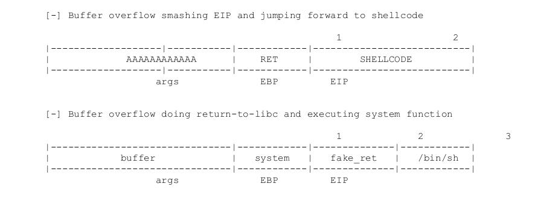
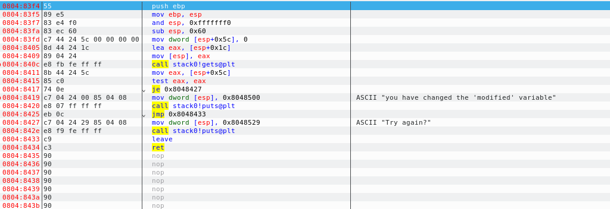
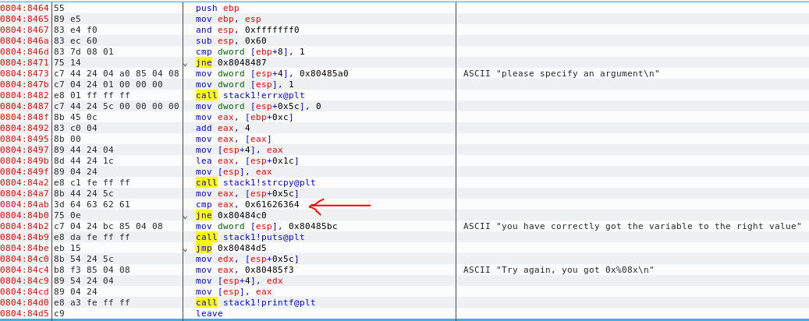
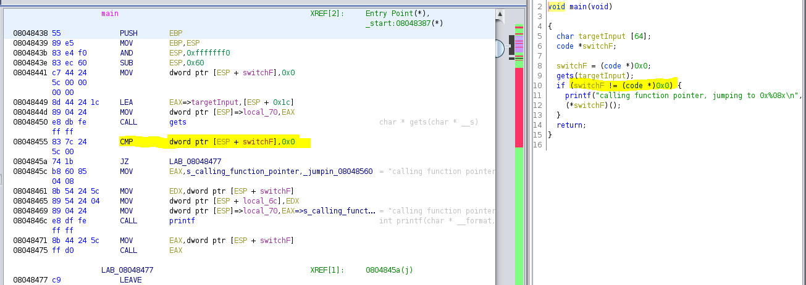

# Protostar challenges
This section documents the work done on solving the prostar challenges which can be found here [Link]().
The Prostar VM is a debian based Linux OS and all the executables are in 32-bit ELF format.

Our initial angle would be try to solve the challenges without looking/referring the source code/hints, which would add the challenge of
reversing to the mix. I have downloaded the crackmes from the protostar VM onto my Kali distro with tools of my choice.

For debugging the crackmes (dynamic/runtime) , I have used EDB or evan's debugger. For the static analysis , I will attempt to use GHIDRA. I have some prior experience with GDB, IDA and ImmunityDBG , which came handy during these excercises. ASLR was disabled for all the challenges in this section.


We have different ways and methods of designing and writing exploits. The ret2libc and vanilla overwrite are 2 of the most common design techniques used for the exploits in this exercise. Look at the code for comments in case something is not clear.

|  |
| :----------------------------: |
|        Exploit designs         |

## Stack-based

### Stack0

The edb is used to run it. We see that the jmp operation is dictated by the Zero flag. JE command performs a JMP when the Zero flag is set. We see that a command "test eax,eax" is used. The test eax is a **bitwise AND** operation. Note that 'test' sets the zero flag, when the result of the and opertaion is zero, i.e the case when both the operands are zero. test eax,eax will set the zero flag, only when eax is zero. 

So, we have to make sure eax is anything but zero to prevent the JMP. The eax is loaded with a value from the stack. 0x5c is the offset. Using buffer overflow we can overwrite this, and achieve the target intended.

|                            |
| :--------------------------------------------------------: |
| EAX register needs to be overwritten with a non-zero value |


### Stack1

In this instead of any arbitary value other than zero, we have to fill the variable using a target value. From the assembly code we see that a '**cmp'** is being performed which determines the outcome of the program.
What we need to do now ,is to calculate the offset of the overflow. This can be done by using a pattern generator which may be found natively with metasploit implementations, or can be found online. This offset is the distance between the start of our payload and the eip overloaded value in bytes. The offset calculation is a recurring concept in initial exploit design.

We find that the offset of the overwritten value is 64. The value being compared is hex \x61\x62\x63\x64. Note that the stack is filled in the direction opposite to buffer growth. Stack grows from high memory to low memory, and the buffer (& heap) grow from low memory to high memory.

|                              |
| :----------------------------------------------------------: |
| Overwrite the eax with a constant value to alter program flow |


### Stack2
This is a similar challenge to Stack1. The point of overflow here is the environment variable. This is the point of entry for the overflow.
We know from the debugger output, that an environment variable called "GREENIE" is being used from the EDB debugger which prints the ASCII strings on screen.
Note that GREENIE needs to cause a buffer overflow, which happens during the vulnerable strcpy function. The value in the EAX register is being compared to 'd0a0d0a' in hex. Again, like in stack1 we need to push a string which offsets at 64. So the value being overwritten is at an exact distance from the start of the string, and we prefill the value with 64 leading A's , and you can do it in any manner except taking care not to include bad characters.

```python
export GREENIE=$(python -c "print 'AAAAAAAAAAAAAAAAAAAAAAAAAAAAAAAAAAAAAAAAAAAAAAAAAAAAAAAAAAAAAAAA\x0a\x0d\x0a\x0d'")
```
Now the next thing would be to run the program, which will give us the desired output.  

|              |
| :-------------------------------------------------: |
| Altering the environment variable to cause overflow |


### Stack3
The function in main checks a value which I replaced in **Ghidra** to the name 'switchF' and 'targetInput' is the one we need to overflow. We can see from the disassembled code clearly what is happening without having to read much assembly code. We see that the switchF needs to change, for our function to enter the if condition. The jump however needs to happen to a different function for us to win this challenge. There is only 1 non-c non-library function as Ghidra points out which is 'win'. We need to store this address value on the switchF, for us to successfully execute this function and win the challenge.
We can see from the images the offset address we need to overwrite. 

We can see that once we do this and overwrite using the offset we are able to overwrite the variable with success. It should be noted that function local variables are stored in the stack in the order they are declared. Note that we can overwrite the 'switchF' as it is declared after the 'targetInput' variable. So targetInput goes in the stack first, followed by the switchF. When the buffer overflows, the overflow is written onto the next variable stored in the stack. Always remember the layout of the function frame including the EBP and the RET address values when performing an overflow. The functions in the absence of ASLR are loaded at a fixed offset from a fixed starting address space.

|       |
| :-----------------------------------: |
| Looking at the disassembled functions |

|                        |
| :----------------------------------------------------------: |
| The variable 'switchF' is in our control because of overflow of 'targetInput' |

### Stack4 

Vanilla Buffer overflow. Here we overwrite the return address, like covered in several exploit research exercises before. The steps are to calculate the offset, and supply the exploit via command-line arguments to the exploit as shown below.
```python
python -c "print 'AAAAAAAAAAAAAAAAAAAAAAAAAAAAAAAAAAAAAAAAAAAAAAAAAAAAAAAAAAAAAAAAAAAAAAAAAAAA\xf4\x83\x04\x08'" | ./stack4
```

|                            |
| :----------------------------------------------------------: |
| A vanilla buffer overflow exploit, controlling the EIP to point to our desired function |

### Stack5

In this challenge, we need to perform a buffer overflow and spawn a shell. Basically, our payload here is a shellcode, and we can write our own or use an existing shellcode. As any standard exploit we need to overwrite the return address and make it point to our shellcode. You can write your own shellcode here, and complete the challenge. This challenge , even though I have executed several buffer overflows for countless similar c programs threw me off. The source code is as simple as it can get. I figure here that because of certain headers being included, this behaves like this. The shellcode runs into an error where it shows "ILLEGAL Instruction" for quite a while, before I had to go with a different exploit design.

My initial exploit was 
```bash
::NOPSLED::SHELLCODE::PADDING::EIP:: 
```

Here the EIP points back to the shellcode. Due to being present in lower memory address, the shellcode was showing ILLEGAL instruction. As of writing this , I am still trying to figure out why this exploit design failed. Next, I tried a different exploit design suggested by the famous ["LiveOverflow"](https://liveoverflow.com/) in his videos, and added a NOPSLED size of 400 to place the shellcode lower in stack (higher memory).

```bash
::PADDING::EIP::HUGE-NOPSLED::SHELLCODE
```
This worked after piping an extra character via cat. The shellcode like others have been tested to work on Ubuntu16.04. This is because the bin/bash shell being called from the unistd.h header was expecting a character. This is highlighted by **liveoverflow** in his description of the exploit solution.

The exploit is piped to STDOUT and in the file stack5.py. To pipe it from within gdb(make sure the executable is loaded):
```bash
run < <(./stack5.py)
```

From outside gdb, we need to pipe the extra char.

```bash
(./stack5.py;cat) | ./crackmes/stack5
```

|     |
| :--------------------------------------------: |
| The overwrite using the payload is successful. |


### Stack6

This challenge is a curve ball, even though the underlying technique of exploitation is well known. The binary here prevents us to overwrite the return address with some specific prefix. The check is put on the stack for preventing us using the vanilla exploit methods. Here we will use a technique which we used in the exploit-research for Win32 systems which is known as 'return-to-libc'. This is often used to bypass 'exec' protections on stack. There are several variations to this method 
such as the 'libc chaining' method which is explained by 'Phrack' in this article [here](http://phrack.org/issues/58/4.html). The libc method exploits the control of the stack, and its layout specifically. In a restriction on stack execution, the shellcode may not reside on the stack. The technique return-to-libc lays out the stack after an overflow as shown by the following image.

"Insert image here"

We find a systemcall in the libc in the executable library. Instead of EIP pointing to a shellcode, EIP would now point to this address. In a function layout , a function's instruction pointer usually points to the EBP (before the instruction for carving out space for local variables is hit) as shown in the image. The next (higher in memory, lower in stack) value is the return address of the next function. Here we can point to exit() so that the process exits. We would spawn a separate process on execve execution. 

The next instruction would be the function argument for the current function. This for a systemcall would be the address of the command string being called. In this case, this must be the address of the string "/bin/bash". There are several methods to locate this string in the executable using the 'strings' utility. On GUI debuggers such as the EDB this is trivial. Alternatively, one may store the string in an environment variable and point to the address of the environment variable to avoid locating the string.

Locating system call within the libc and having executable privileges is easy on EDB, and on GDB , one may simply do the following to find out the location of the systemcall as shown from within gdb. You may use other utilities such as mselfscan (a metasploit utility) or using the 'strings'utility. 

Note that the libc syscall takes only 1 argument which is the string address of the function being called. The stack6.py was used to generate the payload which was tested on the executable running on a 16.04 Ubuntu system.

|                            |
| :----------------------------------------------------------: |
| Locating a syscall for performing ret2libc in the desired address range in EDB |

### Stack 7

This challenge again, reimposes a restriction on the blatant overriding of return address. Here we will employ a technique called "return to .text". If you look at the source code for this challenge , you will discover that the source code is very much similar. In stack6 the logic is checking for return address to not be in the stack range of the stackaddress and some of the code address which is the '\xbf' prefix. This was bypassed using the 'ret2libC' technique as the libC address was not in the restricted range. Usually, the libC technique is used for bypassing stack execution restriction, but here we have a restriction which prevents us from returning to libC

In stack7, the restricted address range for the EIP overrun, covers the libC region as well, thereby preventing the ret2libC exploit from working. Here we have to overwrite the EIP to point to something which controls the EIP via control of the stack. There are many variations and methods to accomplish this, the ultimate aim is to get execution without violating the address space check on EIP. We know that the EIP has to point to something which is not present in any address with prefix '0xb. Note, that here the stack is executable, so we can actually place our shellcode on the stack. To achieve this we must point to opcode strings which allow us to return execution to our shellcode. The basic idea would be to point to a 'RET' instruction and have our EIP point to this. We would have to place the address of our shellcode right adjacent to the stack so that the ret causes the address of the shellcode to be pushed onto EIP. But as we'd see, the shellcode address is restricted.


## Format String Vulnerabilities
These are set of challenges which require us to exploit the format string vulnerability. This is a class of vulnerability which exploits the format string which is an ascii string used to specify and control the representation of various variables. You can use it to read and write memory on the stack, thereby controlling the program execution. String formats such as "%d" and "%s" are used by functions like printf and sprintf to read/write memory on the stack. When passed as part of string input to vulnerable functions this can cause an outcome where the %s is treated as a format string to read the memory on the stack. "%n" is used to write to memory on the stack.
In the following set of challenges, we will achieve our exploit using the format string vulnerability, even when there are certain exploits where we can use the buffer overflow vulnerability.


### Format0

This one is the starting challenge and can be exploited both by an overflow and a format string exploit. The function code is provided below for reference, but we can do it without looking at this and just the disassembly as well.
If you look at the disassembly, you will see that a value is being compared with the EAX register , the very famous "deadbeef" string. If we can control the value stored in EAX, we can win this challenge, or if we can control the EIP to enter the instruction after the "JNE" instruction to avoid the branching altogether. We can accomplish this via a simple buffer overflow (at an offset of 64), but the challenge mentions that we need to do it < 10 bytes.

For the sanity check we can turn off ASLR, and achieve the outcome via buffer overflow as shown below. The pattern generated is 64 bytes long, and appended by "deadbeef" in reverse order.
```
./format0 $(python -c "print 'Aa0Aa1Aa2Aa3Aa4Aa5Aa6Aa7Aa8Aa9Ab0Ab1Ab2Ab3Ab4Ab5Ab6Ab7Ab8Ab9Ac0A\xef\xbe\xad\xde'")
```

Let us achieve the outcome within the confines requested by this challenge. We can achieve the exploit by padding with a 64 bit format string and then appending the "deadbeef". So, the exploit can be of the following form.
```
./format0 $(python -c "print '%64d\xef\xbe\xad\xde'")
```
This would be the case where you would get a padding of 64 bytes. The buffer will be filled with64 bytes. The string containing %d is a format string. When we use it within say printf command *printf("%d",x)"*. It expects the first argument to be at *(ret addr+4 bytes)*, 2nd argument to be at *(ret address +8 bytes)*. printf you see, is a variadic function, i.e It can take multiple arguments. The function arguments are present outside the stackframe (lower in the stack, higher in memory than the return addr and EBP). For variadic functions in x86 architectures, the choice of calling functions is cdecl. 
There are different ways in which functions are called in x86 architectures which are present [here](https://devblogs.microsoft.com/oldnewthing/20040108-00/?p=41163). 

So how does the exploit work? With %64d we just told printf to read 64 bytes of the stack as arguments. So printf being a variadic function reads 64 bytes.

However this exploit does not work on a 64 bit modern system with ASLR enabled. See liveoverflow's video to see how to exploit and bypass this challenge on a modern system.


### Format1

For format1 we need to overwrite the target value. So far, we know that the format string vulnerability can be used to leak data off the stack. Even if stack is randomized, we can leak the stack information. For some challenges, we may be able to leak the stack canary and beat stack protection via memory leakage. For reading off the stack we can use certain characters like ("%d", %x) depending on how we format the data being read off the stack. However, in the man page of printf, we can see that there exists a format character called "%n", which can be used to read the value of the last written to variable.

"%n" in the man page is considered as a security flaw as well when dealing with untrusted user input. So what does "%n" do?
Consider the following code as stated in a stack overflow in an [answer](https://stackoverflow.com/questions/3401156/what-is-the-use-of-the-n-format-specifier-in-c) to the same question.
```C
#include <stdio.h>

int main()
{
  int val;

  printf("blah %n blah\n", &val);

  printf("val = %d\n", val);

  return 0;

}
```
The first printf has been passed the pointer (address) to the variable val. The first printf will not read any value, but write a value to the passed address. The value will be characters written so far in the printf statement. This value is 5, as there are 4 chars ('blah') plus 1 space written in the printf before '%n' is encountered. The second printf will print "val = 5".

Here our task is to overwrite the target variable to successfully pass this challenge, and hence we must make use of the "%n" command as stated above. We will have to write to the target variable on the stack. 


One more thing to note here, is that this won't work with ASLR enabled. With ASLR enabled, the stack only prints the address of the string on doing "%x" overflow, and not the actual string being stored on the stack.
Due to format string vulnerability we can print memory on the stack. When doing these challenges, always remember that our vulnerable function could be nested within functions, and be clear with the structure of the stack frame.


